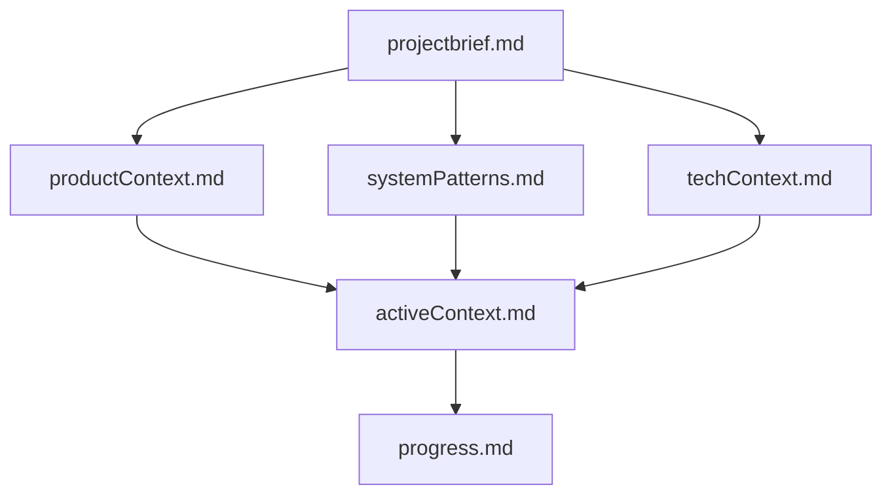
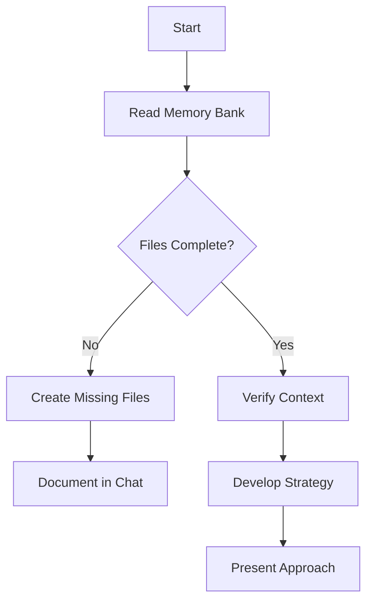
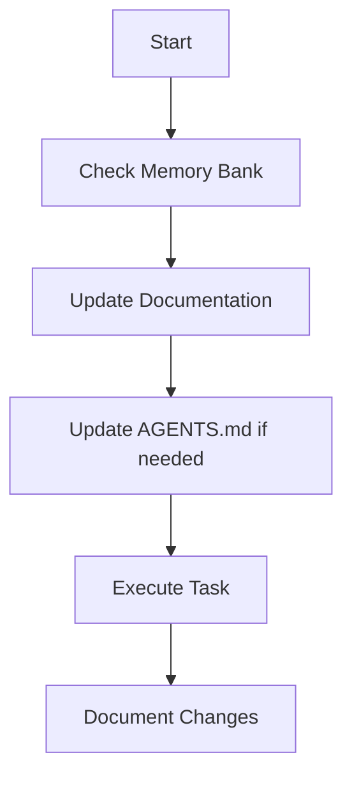
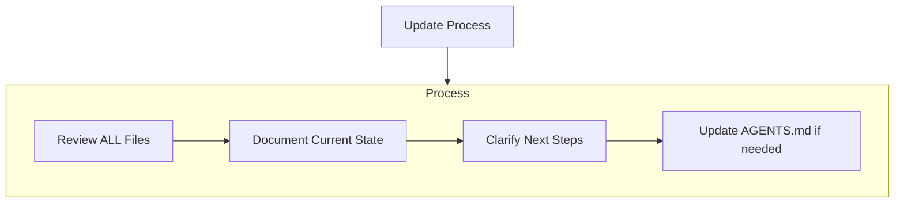

# Memory Bank (Agent Instructions)

Many coding agents do not retain memory between sessions. Treat that as true here: after a reset, you must rely on the Memory Bank to understand the project and continue work effectively.

At the start of every task:
- Read ALL Memory Bank files (required core files first).
- If files are missing, create them before making significant changes.

## Memory Bank Location
All Memory Bank files live in `memory-bank/`.

## Memory Bank Structure
The Memory Bank consists of required core files and optional context files, all in Markdown format. Files build upon each other in a clear hierarchy:

### Core Files (Required)
1. `projectbrief.md`
   - Foundation document that shapes all other files
   - Created at project start if it doesn't exist
   - Defines core requirements and goals
   - Source of truth for project scope

2. `productContext.md`
   - Why this project exists
   - Problems it solves
   - How it should work
   - User experience goals

3. `activeContext.md`
   - Current work focus
   - Recent changes
   - Next steps
   - Active decisions and considerations

4. `systemPatterns.md`
   - System architecture
   - Key technical decisions
   - Design patterns in use
   - Component relationships

5. `techContext.md`
   - Technologies used
   - Development setup
   - Technical constraints
   - Dependencies

6. `progress.md`
   - What works
   - What's left to build
   - Current status
   - Known issues

### Additional Context
Create additional files/folders within `memory-bank/` when they help organize:
- Complex feature documentation
- Integration specifications
- API documentation
- Testing strategies
- Deployment procedures

## Core Workflows

### Plan Mode

### Act Mode

## Documentation Updates
Memory Bank updates occur when:
1. Discovering new project patterns
2. After implementing significant changes
3. When user requests with **update memory bank** (MUST review ALL files)
4. When context needs clarification

Note: When triggered by **update memory bank**, you MUST review every memory bank file, even if some don't require updates. Focus particularly on `activeContext.md` and `progress.md` as they track current state.

## AGENTS.md Conventions (This Repo)
AGENTS.md is standard Markdown. Use it as a predictable place for instructions to coding agents.

Nesting:
- You can add additional `AGENTS.md` files in subdirectories.
- The closest `AGENTS.md` to the file being edited takes precedence.
- If instructions conflict, the closest `AGENTS.md` wins; explicit user instructions in chat override everything.

Best practices:
- Keep instructions focused and actionable.
- Prefer referencing `memory-bank/` docs over duplicating large blocks.
- Update AGENTS.md as project patterns evolve.

# Planning
When asked to enter "Planner Mode" or using the /plan command, deeply reflect upon the changes being asked and analyze existing code to map the full scope of changes needed. Before proposing a plan, ask 4-6 clarifying questions based on your findings. Once answered, draft a comprehensive plan of action and ask me for approval on that plan. Once approved, implement all steps in that plan. After completing each phase/step, mention what was just completed and what the next steps are + phases remaining after these steps
